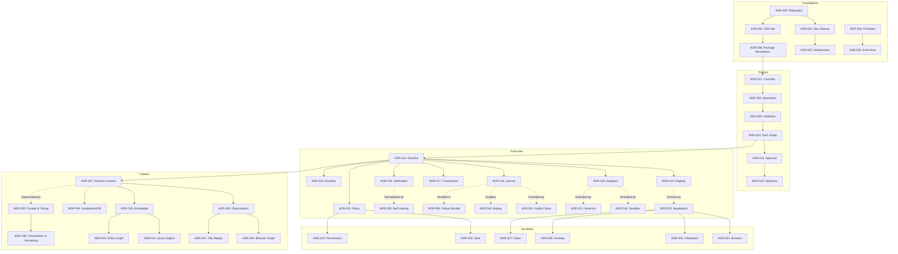

# Architecture Decision Records (ADRs)

This directory houses the formal, numbered Architecture Decision Records for usePilot. Every architectural decision, schema foundation, and boundary evolution is captured here chronologically.

---

## 1. ADR Network Graph

The following diagram maps the structural evolution and dependencies connecting decisions across subsystems:

---

## 2. Decision Traceability ("Why Not X?")

| Architectural Decision | Chosen Solution | Alternative Evaluated | Why The Alternative Was Rejected |
|---|---|---|---|
| **Architecture Topology** | Bun sidecar + Tauri desktop shell ([ADR-001](ADR-001-bun-sidecar.md)) | Monolithic Node.js Electron or 100% Rust backend | Electron suffers from excessive RAM footprints; pure Rust forces rewriting rapid TypeScript ecosystems (Playwright, Drizzle ORM, LLM parsers) and slows development velocity. Bun provides native SQLite, fast cold start, and sub-millisecond IPC. |
| **Client Communication** | WebSocket bi-directional streaming ([ADR-003](ADR-003-websocket-streaming.md)) | HTTP Polling or Server-Sent Events (SSE) | SSE is unidirectional; it cannot support immediate human approval confirmations, interactive pause/resume signals, or cooperative cancellation without a second HTTP request channel. |
| **Execution Loop** | Deterministic state machine consuming immutable blueprints ([ADR-013](ADR-013-execution-runtime.md)) | Continuous LLM-in-the-loop autonomous agent loops | LLM-in-the-loop execution introduces unpredictable latency, random tool choices, recurring token costs, and non-reproducible runs. Separating planning from execution guarantees determinism and crash restartability. |
| **Adapter Selection** | Policy-based dynamic capability negotiation ([ADR-020](ADR-020-capability-negotiation.md)) | Hardcoded tool strings (e.g. "playwright", "bash") | Hardcoded tool strings break across operating systems (e.g. bash on Windows) and prevent fallback chains. Capability negotiation matches against host OS, runtime availability, and dependency graphs. |
| **Audit Log** | Append-only SQLite journal ([ADR-016](ADR-016-execution-journal.md)) | Generic text log files (`winston`, `pino`) | Unstructured log files require complex regex parsing, cannot be queried with relational SQL joins, and do not provide cryptographic ordering guarantees for execution replay. |
| **Failure Handling** | Deterministic 4-stage self-healing cascade ([ADR-028](ADR-028-deterministic-self-healing.md)) | Prompting LLM to "fix the error and try again" | LLM recovery prompts take 3–10 seconds, hallucinate non-existent DOM locators, and lack deterministic safety bounds. The local cascade (`dom -> semantic -> visual -> ocr`) resolves layout shifts in under 200ms. |
| **State Management** | RuntimeContextFacade with hot/warm/cold tiering ([ADR-045](ADR-045-runtime-context-facade-and-tiered-storage.md)) | Global shared memory singleton or external Redis | Global singletons break concurrency and isolated testing. Redis adds a heavy external daemon requirement contrary to usePilot's local-first zero-install desktop ethos. |
| **Search & Retrieval** | Embedded hybrid runtime index ([ADR-041](ADR-041-unified-runtime-query-engine.md)) | Cloud vector databases (Pinecone, Weaviate) | Cloud databases violate user privacy, require network connectivity, and incur recurring cloud API fees. Embedded BM25 + vector indexing runs fully offline. |

---

## 3. ADR Master Index

| ID | Title | Status | Category | Notes / Superseded By |
|---|---|---|---|---|
| [ADR-000](ADR-000-project-philosophy.md) | Project Philosophy | Accepted | System | Foundational principles: local-first, deterministic, safe |
| [ADR-001](ADR-001-bun-sidecar.md) | Bun Sidecar Architecture | Accepted | Architecture | Fast runtime, native SQLite/WS, shared types |
| [ADR-002](ADR-002-ddd-lite-architecture.md) | DDD-Lite Architecture | Accepted | Architecture | Domain boundaries, command/query separation |
| [ADR-003](ADR-003-websocket-streaming.md) | WebSocket Streaming | Accepted | Infrastructure | Bi-directional lifecycle streaming |
| [ADR-004](ADR-004-provider-abstraction.md) | Multi-Provider LLM Abstraction | Accepted | AI Layer | Ollama, LM Studio, OpenAI-compatible adapters |
| [ADR-005](ADR-005-event-bus.md) | In-Memory Typed Event Bus | Accepted | Infrastructure | Asynchronous decoupling within backend sidecar |
| [ADR-006](ADR-006-package-boundaries.md) | Package Boundaries & Inversion | Accepted | Architecture | Unidirectional hierarchy; no circular dependencies |
| [ADR-007](ADR-007-request-classifier.md) | Request Classifier | Accepted | Planner | Two-pass heuristic + provider fallback routing |
| [ADR-008](ADR-008-normalizer.md) | Input Normalizer | Accepted | Planner | Deterministic text cleaning and entity extraction |
| [ADR-009](ADR-009-three-layer-validation.md) | Three-Layer Validation Suite | Accepted | Planner | Schema, semantic, and execution feasibility checks |
| [ADR-010](ADR-010-task-graph-dag.md) | Task Graph (DAG) | Accepted | Planner | Kahn's algorithm, topological layers, critical path |
| [ADR-011](ADR-011-approval-policy.md) | Approval Policy & Safety | Accepted | Planner | 4-tier governance: automatic, optional, mandatory, forbidden |
| [ADR-012](ADR-012-plan-optimizer.md) | Plan Optimizer | Accepted | Planner | Deduplication, sequential merging, concurrency |
| [ADR-013](ADR-013-execution-runtime.md) | Deterministic Execution Runtime | Accepted | Execution | State machine runner consuming blueprints without LLM |
| [ADR-014](ADR-014-capability-registry.md) | Capability-Based Registry | Accepted | Execution | Evolved by [ADR-020](ADR-020-capability-negotiation.md) |
| [ADR-015](ADR-015-adapter-architecture.md) | Standardized Adapter Lifecycle | Accepted | Execution | Extended by [ADR-019](ADR-019-adapter-sandbox.md) & [ADR-021](ADR-021-adapter-sessions.md) |
| [ADR-016](ADR-016-execution-journal.md) | Append-Only SQLite Journal | Accepted | Execution | Extended by [ADR-031](ADR-031-runtime-artifact-store.md), [ADR-034](ADR-034-execution-replay.md), [ADR-035](ADR-035-failure-bundle.md) |
| [ADR-017](ADR-017-checkpoint-strategy.md) | Batch & Approval Checkpoints | Accepted | Execution | Integrated with [ADR-044](ADR-044-context-invalidation-and-diff-engine.md) & [ADR-046](ADR-046-context-transactions-and-schema-versioning.md) |
| [ADR-018](ADR-018-verification-model.md) | Independent Verification Model | Accepted | Execution | Feeds into [ADR-028](ADR-028-deterministic-self-healing.md) & [ADR-035](ADR-035-failure-bundle.md) |
| [ADR-019](ADR-019-adapter-sandbox.md) | Adapter Sandbox | Accepted | Execution | Timeout enforcement, panic recovery, output capture |
| [ADR-020](ADR-020-capability-negotiation.md) | Policy-Based Negotiation | Accepted | Execution | Dynamic adapter matching via `CAPABILITY_DEPENDENCY_GRAPH` |
| [ADR-021](ADR-021-adapter-sessions.md) | Adapter Sessions | Accepted | Execution | Scoped session pooling (`capability`, `run`, `task`) |
| [ADR-022](ADR-022-execution-policy-engine.md) | Execution Policy Engine | Accepted | Execution | Single source of truth for runtime parameters |
| [ADR-023](ADR-023-execution-manifest.md) | Cryptographic Execution Manifest | Accepted | Execution | Tamper-evident SHA-256 execution receipt |
| [ADR-024](ADR-024-browser-runtime.md) | Browser Runtime | Accepted | Runtimes | Playwright engine, page pools, locator strategies |
| [ADR-025](ADR-025-native-filesystem-runtime.md) | Native Filesystem Runtime | Accepted | Runtimes | Atomic I/O, path confinement, directory trees |
| [ADR-026](ADR-026-native-desktop-runtime.md) | Native Desktop Runtime | Accepted | Runtimes | OS clipboard, window management, process execution |
| [ADR-027](ADR-027-vision-runtime.md) | Vision Runtime | Accepted | Runtimes | OCR extraction, region analysis, visual assertions |
| [ADR-028](ADR-028-deterministic-self-healing.md) | Deterministic Self-Healing | Accepted | Execution | Cascading element remediation without LLM hallucination |
| [ADR-029](ADR-029-secure-secret-vault.md) | Secure Secret Vault | Accepted | Safety | AES-256-GCM encryption, memory zeroization |
| [ADR-030](ADR-030-permission-manager.md) | Permission Manager | Accepted | Safety | Granular authorization scopes and capability gating |
| [ADR-031](ADR-031-runtime-artifact-store.md) | Runtime Artifact Store | Accepted | Diagnostics | Filesystem storage for large blobs offloaded from SQLite |
| [ADR-032](ADR-032-browser-trace-recording.md) | Browser Trace Recording | Accepted | Diagnostics | Playwright zip traces and forensic screenshots |
| [ADR-033](ADR-033-runtime-health-monitoring.md) | Health Monitoring | Accepted | Diagnostics | Subsystem health telemetry, latency histograms |
| [ADR-034](ADR-034-execution-replay.md) | Execution Replay | Accepted | Diagnostics | Deterministic state reconstruction from journals |
| [ADR-035](ADR-035-failure-bundle.md) | Failure Bundle | Accepted | Diagnostics | Self-contained debug package for post-mortems |
| [ADR-036](ADR-036-runtime-diagnostics.md) | Runtime Diagnostics | Accepted | Diagnostics | Resource leak detection, process tree monitoring |
| [ADR-037](ADR-037-runtime-context-layer.md) | Runtime Context Layer | Accepted | Context | Superseded in public API by [ADR-045](ADR-045-runtime-context-facade-and-tiered-storage.md) |
| [ADR-038](ADR-038-observation-model.md) | Observation Model | Accepted | Context | Typed perceptions across browser, filesystem, desktop |
| [ADR-039](ADR-039-knowledge-store.md) | Knowledge Store | Accepted | Context | Domain facts, operational rules, entity cache |
| [ADR-040](ADR-040-browser-knowledge-graph.md) | Browser Knowledge Graph | Accepted | Context | Web domain topologies, routes, forms, and actions |
| [ADR-041](ADR-041-unified-runtime-query-engine.md) | Unified Query Engine | Accepted | Context | Unified queries across memory, knowledge, observations |
| [ADR-042](ADR-042-observation-replay.md) | Observation Replay | Accepted | Context | Step-by-step forensic perception replay |
| [ADR-043](ADR-043-runtime-entity-graph.md) | Runtime Entity Graph | Accepted | Context | Multi-hop relationships and graph traversals |
| [ADR-044](ADR-044-context-invalidation-and-diff-engine.md) | Invalidation & Diff Engine | Accepted | Context | Fine-grained cache invalidation, snapshot diffing |
| [ADR-045](ADR-045-runtime-context-facade-and-tiered-storage.md) | Facade & Tiered Storage | Accepted | Context | Unified public API boundary; hot/warm/cold memory model |
| [ADR-046](ADR-046-context-transactions-and-schema-versioning.md) | Transactions & Versioning | Accepted | Context | Multi-subsystem atomic transactions with rollback |
