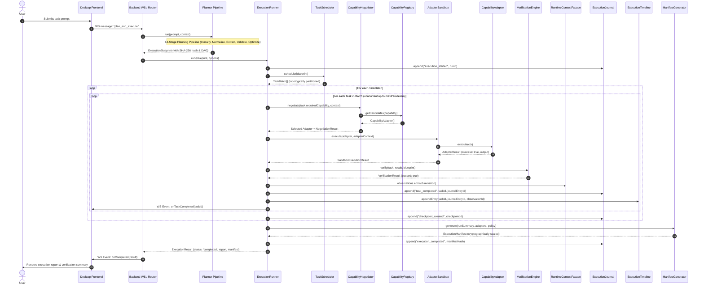
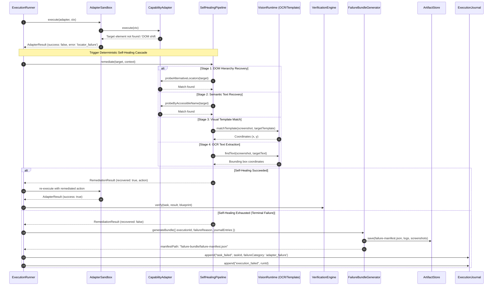
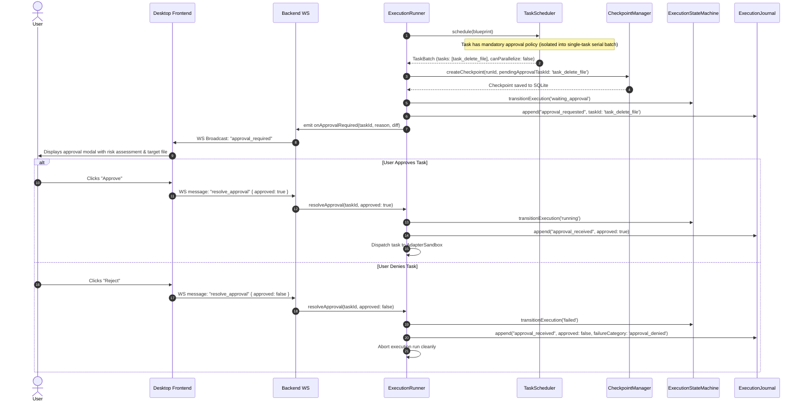
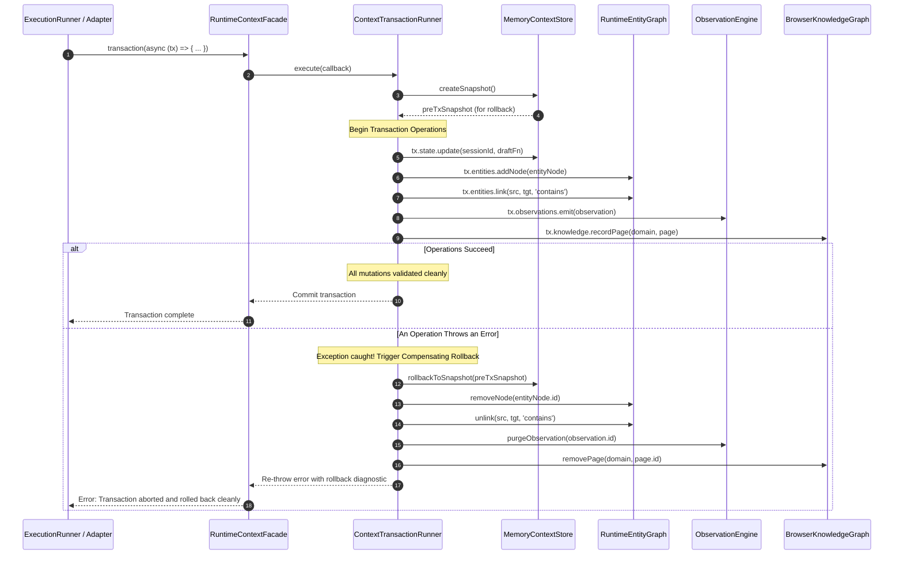

# Runtime Sequence Diagrams

This document illustrates the dynamic runtime behavior, cross-subsystem orchestration, lifecycle transitions, and error recovery sequences in usePilot.

---

## 1. End-to-End Execution Lifecycle

The following sequence details how a natural language request transforms into a validated blueprint and executes through adapters, verification, journaling, and timeline indexing:

---

## 2. Failure Recovery & Deterministic Self-Healing

When an adapter or verification check fails, usePilot enters its self-healing cascade before resorting to failure bundling:

---

## 3. Human-in-the-Loop Mandatory Approval Gate

This sequence demonstrates how mandatory approval tasks are isolated into serial execution batches, snapshotting execution state before awaiting user confirmation:

---

## 4. Multi-Subsystem Context Transaction with Rollback

Demonstrates atomic multi-store mutations within the Runtime Context Layer:

